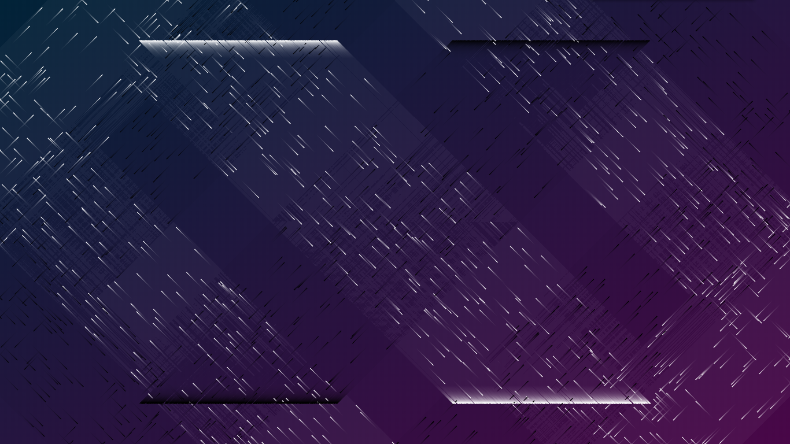

# rainbow-particles
 炫酷粒子特效，适合用于个人网页或其它非正式页面

 效果可以参考我的个人站点：[http://bingchacha.top/](http://bingchacha.top/)

 首先你得在界面上设置一个全屏canvas元素，然后引入js文件：
 ```js
 <script src="./main.js"></script>
 ```

 + 如果想全部使用默认配置则可以直接什么都不设置：
 ```js
    let myRainbow = new Rainbow();
    myRainbow.init();
 ```
 + 或者使用提供的配置项，使用默认参数的可以直接不写
 ```js
    let myRainbow = new Rainbow({
      max_age : 2000,
      part_count : 1000,
      frame_rate : 1,
      top_left_color : 'rgb(204,0,255)',
      top_right_color : 'rgb(0,255,255)',
      bottom_left_color : 'rgb(255,112,12)',
      bottom_right_color : 'rgb(255,10,130)'
    })
    myRainbow.init();
 ```
 解释一下配置项的各参数：
 ```js
    let myRainbow = new Rainbow({
      max_age : 粒子可达的最长寿命，也就是粒子的最大历程，此值越大，粒子的平均路径越长,
      part_count : 一簇粒子的数量，界面总粒子数为此值*4，注意过大会卡顿,
      frame_rate : 粒子在一帧内可达的路径距离，视效上来说，此值越大/小，粒子速度越快/慢,
      top_left_color : 上左簇粒子颜色，可以用rgb形式或十六进制（必须是字符串），下同,
      top_right_color : 上右簇粒子颜色,
      bottom_left_color : 下左簇粒子颜色,
      bottom_right_color : 下右簇粒子颜色
    })
 ```
 可以自己搭配出各种效果以及色彩，这里就随便放几张图吧~

 
 
 